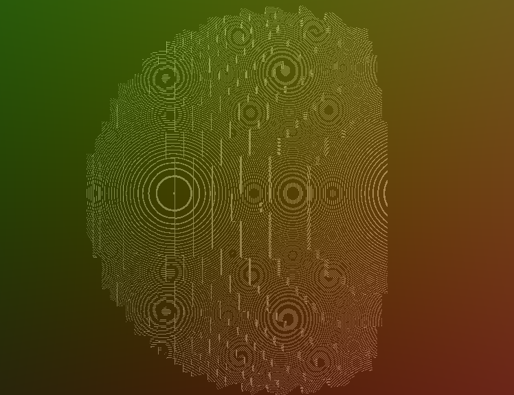

```
██████╗  █████╗ ██╗  ██╗███████╗██╗
██╔══██╗██╔══██╗╚██╗██╔╝██╔════╝██║
██████╔╝███████║ ╚███╔╝ █████╗  ██║
██╔══██╗██╔══██║ ██╔██╗ ██╔══╝  ██║
██║  ██║██║  ██║██╔╝ ██╗███████╗███████╗
╚═╝  ╚═╝╚═╝  ╚═╝╚═╝  ╚═╝╚══════╝╚══════╝
```

**Ray(marched) Voxel Engine**




Raxel is a raymarched voxel engine developed in C99 with Vulkan. It’s an experiment in building a minimal yet powerful engine where compute shaders do all the heavy lifting—no traditional vertex or fragment shaders here!

This project is under active development, so everything in the codebase is very volatile, and the feature set is limited. That said, Raxel has been my playground for experimenting with advanced graphics techniques like raymarching, voxel rendering, and compute shader-based rendering.

## Engine Architecture
Raxel is split into a few parts:

* **Engine Core:**
 Handles the non-Vulkan stuff like building, CLI tools, input management, memory allocation, logging, and more. It’s all about making your development experience smooth.

* **Core Renderer:** Sets up Vulkan, manages multi-pass compute shader pipelines, and handles swapchain targets.

* **Voxel Renderer:** Provides a high-level abstraction for voxel rendering, including voxel world management, chunk handling, and BVH acceleration for faster raymarching.

## Build System & CLI Tools
Raxel’s build system is designed to keep the engine and your game code separate so you can focus on what matters. Some handy CLI commands include:

* `raxel build` – Compiles the engine and your game code.
* `raxel run` – Runs your game executable.
* `raxel update` – Pulls in the latest engine updates.
* `raxel index` – Creates VSCode intellisense JSON files.
* `raxel test` – Runs unit tests for the engine.
* `raxel sc` – Compiles shaders into SPIR-V format.
* `raxel clean` – Cleans up build artifacts.
* `raxel br` – A shortcut that builds, compiles shaders, and runs your game all in one go.

For quick setup, run the install script (scripts/raxel_install.sh) to add the CLI tool to your path.

## Why Raxel?

Raxel is a very specialized engine that is not meant to compete with general-purpose engines like Unity or Unreal. Instead, it’s designed to be a lightweight, flexible tool for quickly prototyping ideas and experimenting with advanced graphics techniques. Here are a few reasons you might want to use Raxel:

* **Voxel Rendering:** Raxel’s voxel renderer is built from the ground up to handle large voxel worlds with ease. It uses raymarching and BVH acceleration to render voxels quickly and efficiently.
* **Minimalistic:** Raxel is designed to be minimalistic and easy to understand. It’s a great way to learn how engines work under the hood, and it’s easy to extend and modify to suit your needs.
* **Compute Shader-based Rendering:** Raxel uses compute shaders for all rendering, making it easy to experiment with new rendering techniques that don't fit the traditional vertex/fragment shader model.

## Getting Started
Clone the Repo:
```bash
git clone https://github.com/evan-bertis-sample/raxel.git
```

Optionally Run the Install Script:
```bash
source ./raxel/scripts/raxel_install.sh
```

And try out the demo!
```bash
cd raxel-demo
raxel build
raxel run
```