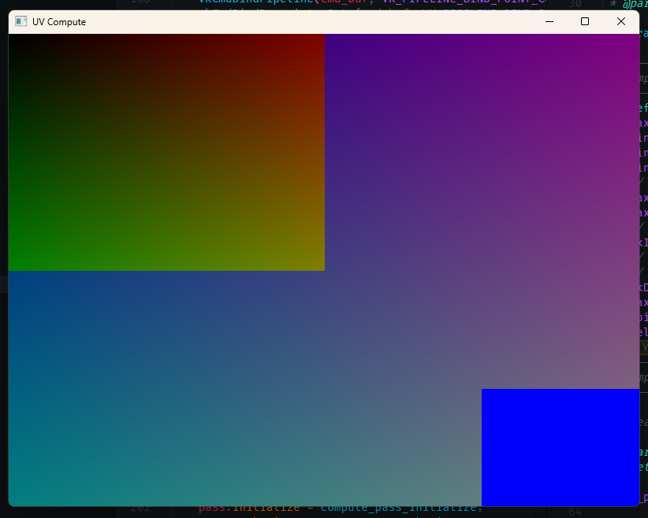

# First Multipass Milestone

## Main Program (the "Game")
```c
#include <raxel/core/util.h>
#include <raxel/core/graphics.h>
#include <raxel/core/graphics/passes/clear_color_pass.h>
#include <raxel/core/graphics/passes/compute_pass.h>
#include <cglm/cglm.h>

#define WIDTH  800
#define HEIGHT 600

int main(void) {
    // Create a surface (this call creates a window and the associated Vulkan surface).
    raxel_surface_t surface = raxel_surface_create("UV Compute", WIDTH, HEIGHT);    
    // Get a default allocator.
    raxel_allocator_t allocator = raxel_default_allocator();
    // Create the pipeline with the surface.
    raxel_pipeline_t *pipeline = raxel_pipeline_create(&allocator, surface);
    
    // Initialize the pipeline (this creates the Vulkan instance, device, swapchain, internal targets, sync objects, etc.).
    raxel_pipeline_initialize(pipeline);
    // Set the debug target to the internal color target.
    raxel_pipeline_set_debug_target(pipeline, RAXEL_PIPELINE_TARGET_COLOR);

    // Create the first pass in the pipeline: a clear-color pass that clears the internal color target to blue.
    raxel_pipeline_pass_t clear_pass = clear_color_pass_create((vec4){0.0f, 0.0f, 1.0f, 1.0f});
    raxel_pipeline_add_pass(pipeline, clear_pass);
    
    // Create a compute shader using our compute shader abstraction.
    // BTW I really like this API -- it mirrors Unity's ComputeShader API, which
    // honestly is one of the best parts of Unity.
    // For this example, we use a shader that outputs UV coordinates (normalized pixel coordinates).
    raxel_compute_shader_t *compute_shader = raxel_compute_shader_create(pipeline, "internal/shaders/uv.comp.spv");
    // Create a compute pass context.
    raxel_compute_pass_context_t *compute_ctx = raxel_malloc(&allocator, sizeof(raxel_compute_pass_context_t));
    // pass the compute shader to the context
    compute_ctx->compute_shader = compute_shader;
    // set some options about dispatching the compute shader
    compute_ctx->dispatch_x = (WIDTH + 15) / 16;
    compute_ctx->dispatch_y = (HEIGHT + 15) / 16;
    compute_ctx->dispatch_z = 1;
    // Set the blit target to the color target.
    compute_ctx->targets[0] = RAXEL_PIPELINE_TARGET_COLOR;
    compute_ctx->targets[1] = -1; // we only have one target, signal the end of the array
    // Describe the push constant buffer layout.
    compute_ctx->pc_desc = RAXEL_PC_DESC(
        (raxel_pc_entry_t){
            .name = "view",
            .offset = 0,
            .size = 16 * sizeof(float),
        },
        (raxel_pc_entry_t){
            .name = "fov",
            .offset = 16 * sizeof(float),
            .size = sizeof(float),
        }       
    );
    // we can attach a callback to be called after the compute shader dispatch finishes
    // for now we do nothing
    compute_ctx->on_dispatch_finished = NULL;

    // Create the compute pass!
    raxel_pipeline_pass_t compute_pass = raxel_compute_pass_create(compute_ctx);
    // Add the compute pass to the pipeline.
    raxel_pipeline_add_pass(pipeline, compute_pass);

    // Run the pipeline main loop.
    raxel_pipeline_run(pipeline);
    // Cleanup after the main loop exits.
    raxel_pipeline_cleanup(pipeline);
    
    return 0;
}
```

## The Compute Shader
```glsl
#version 450
layout(local_size_x = 16, local_size_y = 16) in;

// Our storage image for output (set=0, binding=0).
layout(rgba32f, set = 0, binding = 0) uniform image2D outImage;

void main() {
    // Get the size of the image
    ivec2 imageSize = imageSize(outImage);
    // Get the current pixel position
    ivec2 pixelCoords = ivec2(gl_GlobalInvocationID.xy);
    // Get the normalized pixel position
    vec2 uv = vec2(pixelCoords) / vec2(imageSize);

    if (uv.x > 0.5 || uv.y > 0.5) {
        if (uv.x < 0.75 || uv.y < 0.75) {
            // blend the current color in the output image with the uv color
            vec4 currentColor = imageLoad(outImage, pixelCoords);
            vec4 newColor = vec4(uv, 0.0, 1.0);
            vec4 finalColor = mix(currentColor, newColor, 0.5);
            imageStore(outImage, pixelCoords, finalColor);
        }
        return;
    }

    // Write the pixel color
    imageStore(outImage, pixelCoords, vec4(uv, 0.0, 1.0));
}
```

## The Result

```