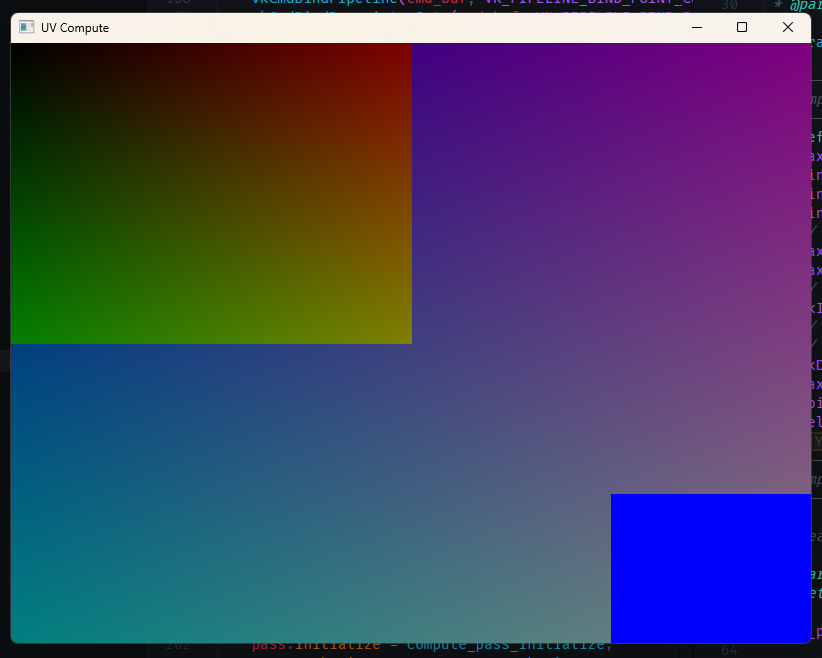

```
██████╗  █████╗ ██╗  ██╗███████╗██╗
██╔══██╗██╔══██╗╚██╗██╔╝██╔════╝██║
██████╔╝███████║ ╚███╔╝ █████╗  ██║
██╔══██╗██╔══██║ ██╔██╗ ██╔══╝  ██║
██║  ██║██║  ██║██╔╝ ██╗███████╗███████╗
╚═╝  ╚═╝╚═╝  ╚═╝╚═╝  ╚═╝╚══════╝╚══════╝
```

# raxel

**A Raymarched Voxel Engine Developed with Vulkan, in C99**

```
Author: Evan Bertis-Sample
Date: 3/21/2025
Course: COMP_SCI 499 (Prof. Geisler)
```

# Overview

This report covers the development of `raxel` within the past quarter. These developments include, but are not limited to:

- The implementation of a Vulkan-based rendering pipeline, that relies on compute shaders for raymarching.
- The development of a voxel data structure that is used to store and render voxel data.
- The implementation of a basic input system that allows for user interaction with the engine.
- The creation of a basic logging system that allows for debugging and logging of engine events.
- The development of a basic windowing system that allows for the creation of windows and surfaces.
- The implementation of a basic memory allocator that is used throughout the engine.
- The creation of a command line interface that allows for easy building and running of the engine, and for the creation of new projects.

# Table of Contents

- [Engine](#engine)
  - [Objectives](#objectives)
  - [High Level Description](#high-level-description)
  - [Notable Design Choices](#notable-design-choices)
- [Rendering Systems](#rendering-systems)
  - [Core Renderer](#core-renderer)
    - [Compute Shader-Driven Graphics Pipeline](#compute-shader-driven-graphics-pipeline)
    - [Abstractions of the Core Renderer](#abstractions-of-the-core-renderer)
  - [Voxel Renderer](#voxel-renderer)
    - [Objectives of the Voxel Renderer](#objectives-of-the-voxel-renderer)
    - [Voxels in Memory](#voxels-in-memory)
    - [Memory Management](#memory-management)
    - [Acceleration Structures (BVH)](#acceleration-structures-bvh)
    - [Rendering Voxels in Compute Shader](#rendering-voxels-in-compute-shader)
- [Demonstration](#demonstration)
  - [Building and Running the Demo](#building-and-running-the-demo)
- [Reflections \& Further Work](#reflections--further-work)
  - [Workflow of using my own Engine](#workflow-of-using-my-own-engine)
  - [Plans for the Spring](#plans-for-the-spring)

# Engine

`raxel` is split into two core parts, the _engine_ and the _rendering systems._

The engine encapsulates the `raxel` that aren't interacting directly with the Vulkan code. Rather, the engine is concerned with building an abstraction around the rendering systems, providing tooling, and making the developer experience better. It also provides many utilities that would be fundamental to building games and technical demos.

Whereas the rendering systems is the portion of `raxel` that directly interact with graphics drivers and utilities, and the abstractions around them.

As of writing this report, the responsibilities of the engine and the rendering systems are split as follows:

- **Engine**
  - Building and compiling games, and linking it with the engine
  - Providing a standard library for the user, namely data structures and wrappers around the rendering system
  - Providing a suite of tools to make development easier - handling unit tests, enabling intellisense (in VSCode), updating the engine, running raxel games, etc.
- **Rendering Systems**
  - Setting up graphics resources, making lower level calls to graphics libraries
  - Creating an abstraction above these resources, allowing the developer to focus on their application of these graphics tools
  - Defining voxels, voxel worlds, and handling the rendering of them

## Objectives

Building the engine was a semi-selfish effort, and it's design is to cater to my (Evan's) workflow. This workflow involves minimum usage of GUI's, a reliance on the CLI, and creating the minimum possible friction to get a project up and running.

The engine is designed to be a tool that I can use to quickly prototype ideas, and to build small games and technical demos. It is not designed to be a full-fledged game engine, nor is it designed to be a general purpose engine. It is designed to be a tool that I can use to quickly prototype ideas, and to build small games and technical demos. To make it an actually full-fledged engine, I would need to additional features -- right now, all of the features are for rendering. Building any game logic would require me to build it from scratch.

## Directory Structure

The engine is split into several directories, and the main focus of the engine thus far have been the `core` and `scripts` directories.

The `core` directory contains the core engine code, and is split into several subdirectories:

- `graphics` - Contains the code for the rendering systems, notably, the implementation of `raxel_surface_t`, `raxel_pipeline_t`, and other Vulkan wrappers. It also contains implementations of `raxel_pipeline_pass_t` which is the bulk, and most important part of the rendering system.
- `util` - Contains common utilities that are used throughout the engine, such as memory allocators, logging, and standard data structures, like lists, arrays, hashtables and strings.
- `input` - Contains the code for the input system, which is used to handle user input, such as keyboard and mouse events. This is a very thin wrapper around GLFW's input system.
- `voxel` - Contains the code for the voxel rendering system, which is used to render voxel data. This is a thin wrapper around the core rendering system, and is used to provide a higher level abstraction for rendering voxels. It also contains the implementation of things like the BVH acceleration structure, and the voxel data structure.

Within this directory, we have a suite of header files that include the headers contained within the subdirectories of `core`. These headers are used to provide a single include point for the user.

In practice, using the engine involves using include statements like this:

```c
#include <raxel/core/graphics.h>
#include <raxel/core/util.h>
```

The `scripts` directory contains the scripts that are used to build and run the engine. These scripts are used to build the engine, build games, run games, and update the engine. The scripts are written in Python, and are used to automate the process of building and running the engine.

Here, you'll find the `raxel.py` script, which is invoked whenever you use a `raxel` command in the terminal. This script simply scans within the `scripts/tools` directory for the subcommands, and runs the appropriate one. Within `scripts/tools`, you'll find the implementation of commands like `build`, `run`, `update`, etc. These are located in files that are named `raxel_<command>.py`. Any files that are not named in this format are not considered subcommands, and cannot be driectly run by the `raxel.py` script.

Before using any of the scripts, you can optionally run `scripts/raxel_install.sh`, which will place `raxel.py` in your path, and allow you to run `raxel` commands from anywhere in your terminal. This is rather important for the use of the engine, as per the [build system section](#build-system), the core raxel engine and the user's game code are seperated, and the user's game code is dynamically linked with the engine.

## Build System

The engine dynamically links with the user's game code. The build system for the engine is built in a manner such that it is not opinionated about the structure of the user's game code.

This choice was made in able to enforce a seperation of concerns in development, and allow for the reusability of the engine. This was used a large amount of development. For example, the testing suite for the engine is built as a "game" that is linked with the engine, and run as a seperate executable, whereas development of the voxel rendering system was debugged in a seperate "game" that was linked with the engine.

By setting up this system early in the processs, it has pushed for a more modular design of the engine. In order to create a demo, the engine would have to provide a series of abstractions to build the demo on top of. This has manifested via the creation of thing like the `raxel_voxel_world_t`, and `raxel_input_manager_t` abstractions.

The only requirement of building a game with `raxel` is that the user must provide an entry point, via `main`, and provide a `raxel.cmake` file within the directory of the game. The `raxel.cmake` file is used to specify the name of the game, and any additional dependencies that the game may have. This system enables the user to build their game in any way they see fit, and to use any libraries that they may need.

Here is an example of such a `raxel.cmake` file:

```cmake
# This will be called from raxel's internal cmake
# The objective of this file is to add the sources and includes to the project
# Then, raxel will take care of linking the libraries and setting the flags

set(SOURCES
    ${RAXEL_PROJECT_ROOT_DIR}/main.c
)

set(INCLUDES
    ${RAXEL_PROJECT_ROOT_DIR}
)

# add the sources and includes to PROJECT executable
target_sources(${PROJECT} PRIVATE ${SOURCES})
target_include_directories(${PROJECT} PRIVATE ${INCLUDES})
```

This builds one of the simplest possible games, with a single source file, `main.c`. The `raxel.cmake` file specifies that the game should be built with this source file, and that the source file should be included in the project.

Internally, the raxel build system uses it's own `CMakeLists.txt` file to build the engine, the dependencies, and the user's game code. The abridged version of the build process is as follows:

```
1. Set up CMake, specifying the project name, minimum version, the languages used, and the project version
2. Find if the user has a `raxel.cmake` file in their project directory. If not, throw an error.
3. Compile the raxel engine as a static library, recursively searching for folders within the raxel/core directory
4. Build and find the dependencies of raxel. These dependencies are Vulkan, GLFW, and CGLM (which is the C version of GLM)
5. Compile the user's game code, in accordance with the `raxel.cmake` file.
6. Link the user's game code with the raxel engine, and the dependencies
```

Creating such a build system required leveraging a work-directory `.raxel`, which gets automatically created to the game's root directory.

For the most part, this folder is used to store the build artifacts of the engine, and the user's game code. This folder is also used to store the `CMakeCache.txt` file, which is used to store the configuration of the build system. This folder is also used to store the `CMakeFiles` folder, which is used to store the build files of the engine, and the user's game code.

A few book-keeping files are also added to this directory. The most useful for development has been the `checksum.txt` file, which is used to store the checksum of the user's game code, and the source files of the engine. This file is used to determine if the user's game code has changed, and if the engine needs to be rebuilt. Whenever the user attemps to run their game, the checksum of the user's game code is compared to the checksum stored in the `checksum.txt` file. If the checksums do not match, the user is alerted that either the engine/game code has changed, and that the engine needs to be rebuilt.

Furthermore, assets are stored in the `.raxel` directory, and are copied to the build directory whenever the user runs their game. This is done to ensure that the assets are always in the correct location, and that the user does not have to worry about copying the assets to the build directory.

## Raxel CLI Tools

There are a few commands that are available:

- `raxel build` - This command is used to build the engine, and the user's game code. This command is used to compile the engine, and the user's game code in the manner described in the [build system](#build-system) section.
- `raxel run` - This command is used to run the user's game code. This command is used to run the user's game code. This simply runs the executable that is created within the `.raxel` directory.
- `raxel update` - Updates the user's version of raxel by pulling the latest version of the core engine from the repository. Because the user's game code is seperate from the engine, this is one of the affordances that the engine provides. The user can update the engine without having to worry about their game code being affected. In development, this has not been used much.
- `raxel index` - Creates necessary JSON files (`c_cpp_properties.json`) for intellisense in VSCode. Because the game code is seperate from the engine, intellisense doesn't work outside the box, one of the drawbacks from seperating engine and game code so strictly.
- `raxel test` - Runs the core raxel unit tests. The unit testing system is a raxel "game" located next to the engine code. This is an end-to-end test of the engine, as running the testing suite involves actually building a "game," which in reality, is just a series of unit tests.
- `raxel sc` - Compiles the shaders in the user's and raxel's code, and places them in the `.raxel` directory. The shaders are compiled into `SPIR-V` format, which is the format that Vulkan uses. Shaders that are part of the engine core are placed in a seperate directory within `.raxel`, `shaders/internal`, and the user's shaders are placed in `shaders/` directly.
- `raxel clean` - Cleans the build directory, and removes the `.raxel` directory. This is useful for cleaning up the build artifacts, and for starting fresh.
- `raxel br` - Compiles the engine, user's game code, and shaders, and runs the game. This is a convenience command that is used to combine `raxel build`, `raxel run`, and `raxel sc` into a single command.

Each of these commands have different subcommands, and can be run with the `--help` flag to see the available subcommands. For example, running `raxel build --help` will show the available subcommands for the `raxel build` command.

# Rendering Systems

The most developed part of `raxel` are the rendering systems. The rendering systems are split into two parts, the core renderer, and the voxel renderer. The core renderer is the wrapper around the Vulkan API, and is used to set up the graphics resources, and make lower level calls to the graphics libraries. The voxel renderer is the wrapper around the core renderer, and is used to provide a higher level abstraction for rendering voxels.

Because the engine is a voxel engine, the voxel renderer has been developed such that the interface is as simple as possible, with minimal knowledged of graphics programming required. The core renderer is more complex, but it is significantly easier than programming directly with Vulkan.

The core renderer achieves:

- Initialization of Vulkan, and all of the boilerplate code that is required to set up the graphics resources
- Creating graphics pipelines and resources
- Taking care of the synchronization of the graphics resources
- Abstracting multi-pass rendering into an easy, declarative interface
- Abstracting over compute shaders
- Passing data between the CPU and GPU

Whereas the voxel renderer achieves:

- Storing voxel data in memory
- Rendering voxels in a compute shader
- Creating acceleration structures for the voxels
- Handling the memory management of the voxel data

## Core Renderer

Below is an abridged version of the demonstration code that will be discussedin the [demonstration](#demonstration) section. This code demonstrates the core renderer and voxel renderer, and how it is used to create a simple raymarched voxel scene.

```cpp
// Called when the surface is destroyed.
static void on_destroy(raxel_surface_t *surface) {
    RAXEL_CORE_LOG("Destroying surface...\n");
    raxel_pipeline_t *pipeline = (raxel_pipeline_t *)surface->user_data;
    raxel_pipeline_cleanup(pipeline);
    raxel_pipeline_destroy(pipeline);
}

int main(void) {
    // Create a default allocator.
    raxel_allocator_t allocator = raxel_default_allocator();

    // Create a window and Vulkan surface.
    raxel_surface_t *surface = raxel_surface_create(&allocator, "Voxel Raymarch", WIDTH, HEIGHT);
    surface->callbacks.on_destroy = on_destroy;

    // Setup input.
    raxel_input_manager_t *input_manager = raxel_input_manager_create(&allocator, surface);

    // Create the pipeline.
    raxel_pipeline_t *pipeline = raxel_pipeline_create(&allocator, surface);
    surface->user_data = pipeline;

    // Initialize the pipeline (creates instance, device, swapchain, etc.).
    raxel_pipeline_initialize(pipeline);

    // Set the debug target to the internal color target.
    raxel_pipeline_set_debug_target(pipeline, RAXEL_PIPELINE_TARGET_COLOR);

    // Create a clear pass to clear the internal color target.
    raxel_pipeline_pass_t clear_pass = clear_color_pass_create((vec4){0.0f, 0.3f, 0.8f, 1.0f});
    raxel_pipeline_add_pass(pipeline, clear_pass);

    // Create the compute shader and pass.
    raxel_pc_buffer_desc_t pc_desc = RAXEL_PC_DESC(
        (raxel_pc_entry_t){.name = "view", .offset = 0, .size = 16 * sizeof(float)},
        (raxel_pc_entry_t){.name = "fov", .offset = 16 * sizeof(float), .size = sizeof(float)},
        (raxel_pc_entry_t){.name = "rays_per_pixel", .offset = 16 * sizeof(float) + sizeof(float), .size = sizeof(int)},
        (raxel_pc_entry_t){.name = "debug_mode", .offset = 16 * sizeof(float) + sizeof(float) + sizeof(int), .size = sizeof(int)}, );
    raxel_compute_shader_t *compute_shader = raxel_compute_shader_create(pipeline, "internal/shaders/voxel.comp.spv", &pc_desc);

    // Create a compute pass context, which is just a struct that holds information about how to dispatch the compute shader.
    raxel_compute_pass_context_t *compute_ctx = raxel_malloc(&allocator, sizeof(raxel_compute_pass_context_t));
    compute_ctx->compute_shader = compute_shader;
    // Set dispatch dimensions based on our window size and workgroup size.
    compute_ctx->dispatch_x = (WIDTH + 15) / 16;
    compute_ctx->dispatch_y = (HEIGHT + 15) / 16;
    compute_ctx->dispatch_z = 1;
    // What resources are we writing to?
    compute_ctx->targets[0] = RAXEL_PIPELINE_TARGET_COLOR;
    compute_ctx->targets[1] = -1;  // Sentinel.
    // You can set a callback to be called when the dispatch is finished.
    compute_ctx->on_dispatch_finished = NULL;

    // Create the compute pass and add it to the pipeline.
    raxel_pipeline_pass_t compute_pass = raxel_compute_pass_create(compute_ctx);
    raxel_pipeline_add_pass(pipeline, compute_pass);

    // Create and populate a voxel world
    raxel_voxel_world_t *world = raxel_voxel_world_create(&allocator);

    // Code to populate the voxel world...

    vec3 camera_position = {0.0f, 0.0f, -50.0f};
    float camera_rotation = 0.0f;

    // Code to initially load/unload chunks based on camera position, and pass the voxel world to the compute shader...

    raxel_pipeline_start(pipeline);

    // Main loop
    // For demonstration, we update the push constants per frame.
    double time = 0.0;
    double delta_time = 0.01;

    while (!raxel_pipeline_should_close(pipeline)) {
        // Poor man's delta time.
        time += delta_time;

        // Simple WASD and QE controls to move the camera.
        if (raxel_input_manager_is_key_down(input_manager, RAXEL_KEY_W)) {
            camera_position[2] += 0.1f;
        }
        // Code to handle other key presses...

        // Update the view matrix.
        mat4 view;
        glm_mat4_identity(view);
        // Rotate the view matrix by the camera rotation.
        glm_rotate(view, camera_rotation, (vec3){0.0f, 1.0f, 0.0f});
        // Translate the view matrix by the negative camera position.
        glm_translate(view, (vec3){camera_position[0], camera_position[1], camera_position[2]});

        // Update the push constants
        raxel_pc_buffer_set(compute_shader->pc_buffer, "view", view);
        // Update fov (e.g., 60 degrees converted to radians).
        float fov = glm_rad(60.0f);
        raxel_pc_buffer_set(compute_shader->pc_buffer, "fov", &fov);
        // Update rays per pixel (e.g., 4 rays per pixel).
        int rpp = 1;
        raxel_pc_buffer_set(compute_shader->pc_buffer, "rays_per_pixel", &rpp);

        // Code to load/unload chunks based on camera position, and pass the voxel world to the compute shader...

        raxel_pipeline_update(pipeline);
    }

    return 0;
}
```

This code is only slightly abridged, only really removing the code for populating the voxel world, and loading/unloading chunks based on camera position. The code demonstrates how the core renderer and voxel renderer are used to create a simple raymarched voxel scene.

In plain English, the code does the following:

1. Creates a window and a Vulkan surface
1. Sets up input handling
1. Creates a pipeline, and initializes it
1. Creates a clear pass to clear the internal color target, making the screen blue
1. Creates a compute shader and pass, which is used to render the voxel scene
1. Creates a voxel world, and populates it with voxel data
1. In the main loop, updates the camera position based on user input
1. Updates the view matrix based on the camera position and rotation
1. Updates the push constants for the compute shader, which includes the view matrix, field of view, and rays per pixel
1. Updates the voxel world based on the camera position
1. Updates the pipeline, which is rendering and presenting the scene
1. Repeats the main loop until the window is closed

To define some terminology, before covering it in greater detail:

- A **raxel pipeline** is a series of pipeline passes. This is _different_ than a Vulkan pipeline.
- A **pipeline pass** is a single logical step in the pipeline. Steps can be like things like clearing the screen, computing the depth buffer, or composing the final image.
- A **compute pass** is a pipeline pass that is driven by a compute shader. This is used to do computations on the GPU.

It is important to note that `raxel_pipeline_t` is **not** the same as a Vulkan pipeline. Instead, `raxel_pipeline_t` can be thought of a series of passes, which internally may have their own `VkPipeline` objects. The `raxel_pipeline_t` is used to abstract over the Vulkan API, and to provide a higher level interface for rendering.

The implementation of the core renderer (and thus, the example) will be discussed in the following sections. Full details of the individual Vulkan resources are not covered, but the most important parts, namely the handling of the swapchain, compute shaders, and the pipeline, are covered.

### Compute Shader-Driven Graphics Pipeline

`raxel` runs purely on compute shaders. There are no vertex or fragment shaders, thus how to fundamentally think about rendering in `raxel` is different than in traditional graphics programming.

Instead of worrying about fragments, vertices, and the like, users only need worry about a few things:

- The compute shader
- The data being passed to the compute shader
- The resources that are being written to
- The order in which the compute passes are executed

The pipeline will keep large resources, specifically the "targets," which are textures that are read and rendered to by compute shaders on the GPU. The effect of this is that the effects of a single pass can be seen in the next pass, thus the order of the passes is important. Because of this, however, this makes multi-pass rendering very easy to implement.

This effect, where the output of one pass is the input of the next is why `raxel_pipeline_t` is called a pipeline. Unforuntately, working with Vulkan causes the term "pipeline" to be overloaded, as a Vulkan pipeline is a different concept than a `raxel_pipeline_t`.

`raxel_pipeline_t` doesn't even have to be used for rendering. It can be used for any series of compute passes, and can be used to do any kind of computation on the GPU. This is a powerful abstraction, and allows for a wide variety of effects to be achieved.



In pseudocode, we can think of the pipeline as doing the following:

```py
# Create a pipeline
pipeline = raxel_pipeline_create()
pipeline.create_resources()

# initialize all the resources needed for the pipeline
for pass in pipeline:
    pass.initialize(pipeline.resources)

# start the pipeline
pipeline.start()

for pass in pipeline:
  # pass in the data needed for the pass, like push constants, and the resources that are being written to
  # run the pass, which effects the targets in the pipeline
  pass.begin(pipeline.resources)
  # seperated into two steps, because sometimes it is nice to reason about the pass in this way
  pass.end(pipeline.resources)


# present the final result to the window
pipeline.present()
```

Upon the "presentation" step, which is part of the `raxel_pipeline_update` function, the pipeline will grab one of the targets as specified via the `raxel_pipeline_set_debug_target` function, and present it to the window. This is how the user sees the final result of the compute passes.

Currently, there are two types of targets, although this can be expanded in the future:

- `RAXEL_PIPELINE_TARGET_COLOR` - This is the internal color target, which is the target that is presented to the window. This is the target that the user sees.
- `RAXEL_PIPELINE_TARGET_DEPTH` - This is the internal depth target, which is used for depth testing. This is not presented to the window, but is used for depth testing in the compute passes.

Some targets to consider in the future are:

- `RAXEL_PIPELINE_TARGET_NORMAL` - This is the internal normal target, which is used for normal mapping. This is not presented to the window, but is used for normal mapping in the compute passes.
- `RAXEL_PIPELINE_TARGET_WORK_BUFFER_X` - This would be a series of work buffers, which are used for intermediate computations. These are not presented to the window, but are used for intermediate computations in the compute passes.

Adding such targets would be simple, and would allow for different types of rendering effects to be achieved, like deferred rendering, normal mapping, and more.

At the Vulkan level, this is achieved by using the swapchain. All of these targets are created as part of the swapchain, and exist in the GPU's memory, persisting between frames and compute passes.

The full initialization of the pipeline looks like this:

```c
int raxel_pipeline_initialize(raxel_pipeline_t *pipeline) {
    __create_instance(&pipeline->resources);
    __pick_physical_device(&pipeline->resources);
    __create_logical_device(&pipeline->resources);
    __create_command_pools(&pipeline->resources);
    __create_sync_objects(&pipeline->resources);
    // Create swapchain using surface dimensions.
    raxel_surface_initialize(pipeline->resources.surface, pipeline->resources.instance);
    __create_swapchain(&pipeline->resources, pipeline->resources.surface->width, pipeline->resources.surface->height, &pipeline->resources.swapchain);
    __create_targets(&pipeline->resources, &pipeline->resources.targets, pipeline->resources.surface->width, pipeline->resources.surface->height);
    __create_descriptor_pool(pipeline);
    return 0;
}
```

When creating compute shader passes, the user can specify the resources that are being written to, and the dimensions of the dispatch. The dispatch dimensions are based on the window size and the workgroup size, and are used to determine how many workgroups are dispatched.

This is done via an array of `raxel_pipeline_target_type_t` enums. In the example code:

```c
// What resources are we writing to?
compute_ctx->targets[0] = RAXEL_PIPELINE_TARGET_COLOR;
compute_ctx->targets[1] = -1;  // Sentinel.
```

In this example, we only read/write to the internal color target. The end of the array is marked with a sentinel value, `-1`, which is used to determine the end of the array. This is because the array is statically sized to be the maximum number of targets that can be written to, which is all of them (currently 2, one for color, and one for depth).

This maps directly into the shader:

```glsl
layout(rgba32f, set = 0, binding = 0) uniform image2D outImage;
```

If you wnated to read/write to both the color and depth targets, you would specify both in the array:

```c
compute_ctx->targets[0] = RAXEL_PIPELINE_TARGET_COLOR;
compute_ctx->targets[1] = RAXEL_PIPELINE_TARGET_DEPTH;
// no need for sentinel, as we know there are only two targets
```

This would map to the shader as:

```glsl
layout(rgba32f, set = 0, binding = 0) uniform image2D outImage;
layout(r32f, set = 0, binding = 1) uniform image2D outDepth;
```

Internally, the compute shader needs to be passed a description of what textures are being written to. We never have to pull the textures from the GPU, then pass them to the compute shader. Instead, we basically pass a set of pointers to the compute shader, and the compute shader knows what to do with them.

This system cuts down on a lot of boilerplate code, makes multi-pass rendering easier to think about, and makes the code more readable.

### Pipeline and Pass Implementations and Interface

A large amount of thought was put into the interface of the pipeline and passes. Having seen a large amount of disapointing interfaces in other engines, it was a priority to make the interface as simple as possible, while still being powerful.

The scope of the pipeline being entirely compute shader driven made reasoning about this interface easier. The most important part of defining this interface was structring the data.

```c
typedef struct raxel_pipeline {
    raxel_pipeline_globals_t resources;
    raxel_list(raxel_pipeline_pass_t) passes;
} raxel_pipeline_t;
```

Pipelines are constituted of a list of passes, and the resources that are shared between the passes. These resources are:

```c
typedef struct raxel_pipeline_globals {
    raxel_allocator_t allocator;
    VkInstance instance;
    VkPhysicalDevice device_physical;
    VkDevice device;
    VkQueue queue_graphics;
    VkQueue queue_compute;
    uint32_t index_graphics_queue_family;
    uint32_t index_compute_queue_family;
    raxel_surface_t *surface;
    VkCommandPool cmd_pool_graphics;
    VkCommandPool cmd_pool_compute;
    raxel_pipeline_swapchain_t swapchain;
    VkSemaphore image_available_semaphore;
    VkSemaphore render_finished_semaphore;
    VkDescriptorPool descriptor_pool;
    raxel_pipeline_targets_t targets;
} raxel_pipeline_globals_t;
```

This is the most volatile part of the pipeline -- the design of this structure frequently. During development, resources were added and removed from this structure as needed.

The most notable part of the this global resources structure is the `raxel_pipeline_targets_t` structure, which is used to store the targets that are being written to by the compute passes. This structure is defined as:

```c
typedef struct raxel_pipeline_target {
    raxel_pipeline_target_type_t type;
    VkImage image;
    VkDeviceMemory memory;
    VkImageView view;
} raxel_pipeline_target_t;

typedef struct raxel_pipeline_targets {
    // Internal targets stored as an array indexed by raxel_pipeline_target_type_t.
    raxel_pipeline_target_t internal[RAXEL_PIPELINE_TARGET_COUNT];
    // Which target (by index) should be used for presentation/debugging.
    raxel_pipeline_target_type_t debug_target;
} raxel_pipeline_targets_t;
```

The `raxel_pipeline_target_t` structure was extremely nice to work with, as it allowed for the implementation of the compute passes to be very simple. Throughout develpment, parts of this structure were added and removed as needed, but the core structure remained the same.

The `raxel_pipeline_pass_t` structure is used to define a single pass in the pipeline. This structure is defined as:

```c
typedef struct raxel_pipeline_pass {
    raxel_string_t name;
    raxel_pipeline_pass_resources_t resources;
    raxel_allocator_t allocator;
    void *pass_data;
    void (*initialize)(struct raxel_pipeline_pass *pass, raxel_pipeline_globals_t *globals);
    void (*on_begin)(struct raxel_pipeline_pass *pass, raxel_pipeline_globals_t *globals);
    void (*on_end)(struct raxel_pipeline_pass *pass, raxel_pipeline_globals_t *globals);
} raxel_pipeline_pass_t;
```

The `raxel_pipeline_pass_t` structure is used to define a single pass in the pipeline. This structure is used to define the name of the pass, the resources that are used by the pass, the allocator that is used by the pass, the pass data, and the functions that are used to initialize, begin, and end the pass. This structure is used to define the interface for the passes, and is used to define the functions that are used to initialize, begin, and end the passes.

Resources for the pass are allocated by the pipeline, and given to the pass. This is meant to provide commonly used, but isolated resources to the pass. Currently, the only resource within `raxel_pipeline_pass_resources_t` is the `VkCommandBuffer` that is used to record the commands for the pass.

The most essential part of the pass structure was the `void *pass_data`. Having this pointer allowed for the user to store any data that they needed for the pass. In a way, combined with the `on_begin` and `on_end` functions, a slight amount of `OOP` and `polymorphism` was achieved. The user could define their own pass data, and define their own `on_begin` and `on_end`. This is used heavily in the implementation of the passes.

Forexample, `raxel_compute_pass_context_t` structure is used to define the context for the compute pass. This structure is defined as:

```c
typedef struct raxel_compute_pass_context {
    raxel_compute_shader_t *compute_shader;
    uint32_t dispatch_x;
    uint32_t dispatch_y;
    uint32_t dispatch_z;
    // Which internal target to use for blitting the compute result.
    int8_t targets[RAXEL_PIPELINE_TARGET_COUNT];
    // Optional: if non-null, use this image as the computed result.
    VkImage output_image;
    // Callback invoked after dispatch finishes.
    // If NULL, the default blit callback is used.
    VkDescriptorImageInfo *image_infos;
    raxel_size_t num_image_infos;
    void (*on_dispatch_finished)(struct raxel_compute_pass_context *context, raxel_pipeline_globals_t *globals);
} raxel_compute_pass_context_t;
```

Without the `void *pass_data` pointer, this would cause unecessary bloating of the `raxel_pipeline_pass_resources_t` structure, which would make the resources harder to manage. Not all passes need the same individual resources, hence why the `void *pass_data` pointer was so essential.

These structures made a lot of code very declarative. For example, this is what it means to "update" the pipeline:

```c
void raxel_pipeline_update(raxel_pipeline_t *pipeline) {
    if (raxel_surface_update(pipeline->resources.surface) != 0) {
        return;
    }
    raxel_size_t num_passes = raxel_list_size(pipeline->passes);
    for (size_t i = 0; i < num_passes; i++) {
        raxel_pipeline_pass_t *pass = &pipeline->passes[i];
        if (pass->on_begin) {
            pass->on_begin(pass, &pipeline->resources);
        }
        if (pass->on_end) {
            pass->on_end(pass, &pipeline->resources);
        }
    }

    raxel_pipeline_present(pipeline);
}
```

At the same time however, usage of the function pointers, void pointers, hides a lot of complexity from the user, and made the executable harder to debug with `gdb`. However, the interface for actually using the pipeline became very simple, which was one of the main goals of the engine.

## Voxel Renderer

Sitting directly on top of the core renderer is the voxel renderer. The voxel renderer is used to provide a higher level abstraction for rendering voxels, and implement important features like the BVH acceleration structure, and the voxel data structure. It also handles the memory management, and chunking of the voxel data.

The voxel renderer uses **raymarching** to render the voxels. Raymarching is a technique used to render 3D scenes, where rays are cast from the camera, and the scene is rendered by marching along the ray, and sampling the scene at each point. This is a simple, but powerful technique, and is used in many modern rendering engines.

In a voxel world, the scene is simply a 3D grid of voxels. This is unlike traditional rendering, where the scene is a collection of meshes. Whereas meshes appoximate the surface of the scene, voxels represent the entire volume of the scene. However, because we are not using meshes, we cannot use traditional rasterization techniques to render the scene. Instead, we use raymarching.

This is perfectly suited for the abstractions created by `raxel`'s core rendering system and abstractions, which are based around compute shaders. Because voxel rendering doesn't have any meshes to begin with, and neither does the core renderer, the voxel renderer is a perfect fit for the core renderer.

### Raymarching at a Glance

Raymarching is a very intuive technique, moreso than traditional rasterization. With raymarching, we effectively simulate the path of a ray of light through the scene, and sample the scene at each point along the ray. 

To simulate the path of a ray of light, we move in discrete steps, "marching" along the ray. At each step, we sample the scene, and determine if the ray has hit an object. If the ray has hit an object, we can determine the color of the object, and the ray is done. If the ray has not hit an object, we continue to march along the ray. You can extend the technique to to further bouncing of light rays, to achieve effects like shadows, reflections, and refractions.


Although simple in theory, there are a few things to consider when implementing raymarching:
* What is the step size of the ray?
* How do we determine if the ray has hit an object?

With voxels (at least the way they are implemented in `raxel`), there are a few things to consider:
* If the ray has hit a voxel, how do we determine the normal of the voxel?
* How do we determine the color of the voxel?

These become unknowns with `raxel`'s implementations of voxels because of the way that voxels, are stored in memory (covered in the [voxel renderer](#voxel-renderer) section).

Having too large of a step size can cause the ray to miss objects, and having too small of a step size can cause the ray to take too long to render. As this is a game engine, we want to render the scene as quickly as possible, but provide reliable, consistent results.

### Voxels in Memory

#### Individual Voxels

```c
typedef uint32_t raxel_material_handle_t;

typedef struct raxel_voxel {
    raxel_material_handle_t material;
} raxel_voxel_t;
```

One of most important parts of a voxel renderer is how voxels are stored in memory. In `raxel`, an individual voxel is stored as a `uint32_t`, which is an index into a "palette" of voxel materials. Originally this was a `uint8_t`, but GLSL doesn't support 8-bit integers without using extensions.

Voxel materials, at the moment, are just the albedo color of the voxel, a vec3.

This design allows for better usage of memory, and minimizes the size of the voxel data being sent to the GPU, given that we don't have a unique material for each voxel. Additionally, it allows for easier extension of the voxel materials, as the voxel materials can be expanded to include more information, like normals, roughness, and metalness, without the overhead of storing this information for every voxel.

Additionally, using this palletized system matches with the design of other voxel engines, which have "types" of voxels. It is easier to reason about to place a "dirt voxel" or a "grass voxel" than it is to place a voxel with a specific color. This design allows for the user to define their own voxel materials, and to use them in the voxel world. A side-effect this, is changing the attributes of a voxel material, like the color, propogates to all voxels of that material.

Unfortunately, the design does not allow for voxels to have different attributes within the same material. For some use-cases, being able to do so would be useful, but I have yet to find a reasonable way to implement this.

#### Voxel Chunks & Worlds

```c
typedef struct raxel_voxel_chunk_meta {
    // defines the bottom-left corner of the chunk
    raxel_coord_t x;
    raxel_coord_t y;
    raxel_coord_t z;
} raxel_voxel_chunk_meta_t;

typedef struct raxel_voxel_chunk {
    // all of these voxel's coordinates are relative to the chunk's bottom-left corner
    raxel_voxel_t voxels[RAXEL_VOXEL_CHUNK_SIZE * RAXEL_VOXEL_CHUNK_SIZE * RAXEL_VOXEL_CHUNK_SIZE];
} raxel_voxel_chunk_t;
```

Voxels are stored in chunks, which is a flat array of voxels. Chunks are 32x32x32 sized, which is slightly arbitrary. Using larger chunks means having less metadata for the chunks (thus less memory overhead), and needing to unload/load less chunks. Using smaller chunks means having more fine-grained control over the voxel data, and being able to load/unload chunks more quickly, as well as minimizing the amount of unnecessary voxel data that is loaded (the portion of loaded chunks that are visible can be higher).

Given a local coordinate `(x, y, z)` in a chunk, the index of the voxel in the chunk is `x + y * RAXEL_VOXEL_CHUNK_SIZE + z * RAXEL_VOXEL_CHUNK_SIZE * RAXEL_VOXEL_CHUNK_SIZE`. This is a simple way to convert a 3D coordinate into a 1D index.

Chunk and metadata are stored in seperate lists, in a structure called `raxel_voxel_world_t`:

```c
typedef struct raxel_voxel_world {
    raxel_list(raxel_voxel_chunk_meta_t) chunk_meta;  // index of chunk in chunks
    raxel_list(raxel_voxel_chunk_t) chunks;           // the first __num_loaded_chunks are loaded
    raxel_size_t __num_loaded_chunks;                 // between 0 and RAXEL_MAX_LOADED_CHUNKS
    raxel_allocator_t *allocator;
    raxel_list(raxel_voxel_material_t) materials;
    // book-keeping for updating the voxel world
    raxel_voxel_world_update_options_t prev_update_options;
} raxel_voxel_world_t;
```

Only chunks that have a solid voxel are stored in memory. This makes the `raxel_voxel_world_t` structure sparse and more space efficent, but makes querying the voxel data more complex. Because the world doesn't necessarily describe a rectangular prism of chunks (in the same way that the individual chunks do), we can't use direct indexing to get the chunk data. Instead, we have to iterate over the chunk metadata, and find the chunk that we are looking for.

This is less of a problem on the CPU (because we don't iterate over chunks very often), but on the GPU, this presents a larger problem. This gets into the process of rendering voxels, but this mandatory iteration over the chunk metadata is a bottleneck in the rendering process.

Only the first `__num_loaded_chunks` are actually sent to the GPU. When chunks are loaded/unloaded in the world, they aren't actually removed from the `chunks` list (we would need a method of serializing the chunk data to disk, and loading it back into memory). Instead, we just keep track of how many chunks are loaded, and only send the first `__num_loaded_chunks` to the GPU. Sending only the necessary chunks to the GPU is important, as we don't want to send unnecessary data to the GPU, because we don't want to spend exessive time copying data to the GPU, and filling up the GPU's memory with unnecessary data.

### Chunk Determination and Loading/Unloading

Whenever the camera moves a significant amount (e.g, more than half the size of a chunk), we need to load/unload chunks.

To load and unload chunks effectively means determining which chunks are in the first `__num_loaded_chunks` chunks, and which chunks are not. 

We can very poorly do this by iteraing over all the chunks, and checking if the chunk is within the a certain distance of the camera. This is a naive way to do this, but it is fast for small scenes. Once we find the maximum amount of loaded chunks that we can have, we are done.

The algorithm is as follows:

```python
def update_chunks(camera_position, voxel_world):
    # find the chunk that the camera is in
    camera_chunk = get_chunk_from_world_position(camera_position)

    if not need_to_update_chunks(camera_chunk, voxel_world.prev_update_options):
        return

    # find the chunks that are within a certain distance of the camera
    num_loaded_chunks = 0
    for i, chunk_meta in enumerate(voxel_world.chunk_meta):
        chunk_position = get_chunk_position(chunk_meta)
        distance = get_distance(camera_chunk, chunk_position)
        if distance < MAX_CHUNK_DISTANCE:
            swap_chunks(voxel_world, i, num_loaded_chunks)
            num_loaded_chunks += 1
        if num_loaded_chunks >= RAXEL_MAX_LOADED_CHUNKS:
            break

    voxel_world.__num_loaded_chunks = num_loaded_chunks

def swap_chunks(voxel_world, i, j):
    # swap the chunk metadata
    voxel_world.chunk_meta[i], voxel_world.chunk_meta[j] = voxel_world.chunk_meta[j], voxel_world.chunk_meta[i]
    # swap the chunk data
    voxel_world.chunks[i], voxel_world.chunks[j] = voxel_world.chunks[j], voxel_world.chunks[i]
```

There are a lot of problems with the results of this algorithm. The most notable is that you don't always get the same chunks loaded, even if the camera is in the same position. The order that the chunks are in the `chunk_meta` list is arbitrary, but it has a large effect on the chunks that are loaded. There is a non-zero chance that the chunks that we "load" will be poorly chosen (like behind the camera), and the chunks that we "unload" will be poorly chosen (like in front of the camera, but far away).

You can fix this by taking into account the camera's view frustum, and only loading chunks that are within the camera's view frustum. This is a more complex algorithm, but it is more reliable, and is more likely to load the correct chunks. This reduces the chance that a "poor" chunk is loaded, but doesn't mean that only the "best" chunks are loaded. The best chunks to be loaded are the chunks that are in the camera's view frustum, and are the closest to the camera.

To fix that, we can keep track of which chunks are within the view frustum, sort them by distance, then load at most the first RAXEL_MAX_LOADED_CHUNKS chunks. This is a more complex algorithm, but it is more reliable, and is more likely to load the correct chunks.

With large scenes, this algorithm is not suitable, and would likely result in stuttering -- whenver the camera moves far enough, this slow algorithm would be run, and the scene would freeze while the chunks are loaded. This is not acceptable for a game engine, and is a problem that needs to be solved.

Fixing this would likely involve using a more complex data structure, but for now, the simplest algorithm (what is detailed in the pseudocode) is used - there are signifcantly harder, but more important problems to solve in the engine.

## Naive Voxel Rendering

Using these structures, we can naively render voxels by using a fixed step size, and checking every voxel along the ray. This is a simple, but slow way to render voxels, and is not suitable for large scenes. This is the most basic way to render voxels. Here is the shader for doing so:
```glsl
#version 450

// Compute workgroup size.
layout(local_size_x = 16, local_size_y = 16) in;

// Output storage image (set = 0, binding = 0)
layout(rgba32f, set = 0, binding = 0) uniform image2D outImage;

#define EPSILON 0.01
#define MAX_DISTANCE 1000.0
#define MAX_STEPS 1000
#define RAXEL_VOXEL_CHUNK_SIZE 32
#define RAXEL_MAX_LOADED_CHUNKS 32
#define MAX_RAYS 8

//
// A chunk’s metadata stores its integer coordinates in chunk space and a state value.
//
struct VoxelChunkMeta {
    int x;
    int y;
    int z;
    int state;
};

//
// Each chunk now stores its voxels as a flat array.
// The total number of voxels per chunk is RAXEL_VOXEL_CHUNK_SIZE³.
//
struct VoxelChunk {
    uint voxels[RAXEL_VOXEL_CHUNK_SIZE * RAXEL_VOXEL_CHUNK_SIZE * RAXEL_VOXEL_CHUNK_SIZE];
};

//
// The GPUVoxelWorld holds up to RAXEL_MAX_LOADED_CHUNKS chunks and their metadata.
//
struct GPUVoxelWorld {
    VoxelChunkMeta chunk_meta[RAXEL_MAX_LOADED_CHUNKS];
    VoxelChunk chunks[RAXEL_MAX_LOADED_CHUNKS];
    uint num_loaded_chunks;
};

// Storage buffer (set = 0, binding = 1) holding the voxel world.
layout(std430, set = 0, binding = 1) buffer VoxelWorldBuffer {
    GPUVoxelWorld voxel_world;
};

// Push constants: view matrix, fov (radians), rays_per_pixel (unused)
layout(push_constant) uniform PC {
    mat4 view;
    float fov;
    int rays_per_pixel;
} pc;

//
// A structure to hold the result of raymarching.
//
struct RaymarchResult {
    vec3 pos;
    vec3 normal;
    float tHit;
    bool hit;
};

//
// Helper function: compute a flat index into the voxel array for a given local coordinate.
//
int flatIndex(int lx, int ly, int lz) {
    return lx + ly * RAXEL_VOXEL_CHUNK_SIZE + lz * RAXEL_VOXEL_CHUNK_SIZE * RAXEL_VOXEL_CHUNK_SIZE;
}

//
// Given a world-space voxel coordinate, look through the loaded chunks to find the voxel value.
// This mimics the CPU function that computes chunk coordinates and local coordinates.
// Voxels with value 0 are treated as air; any non-zero voxel is solid.
//
uint getVoxelAtWorldPos(ivec3 worldPos) {
    for (int i = 0; i < voxel_world.num_loaded_chunks; i++) {
        VoxelChunkMeta meta = voxel_world.chunk_meta[i];
        int chunkOriginX = meta.x * RAXEL_VOXEL_CHUNK_SIZE;
        int chunkOriginY = meta.y * RAXEL_VOXEL_CHUNK_SIZE;
        int chunkOriginZ = meta.z * RAXEL_VOXEL_CHUNK_SIZE;
        // Check if the world coordinate lies within this chunk.
        if (worldPos.x >= chunkOriginX && worldPos.x < (chunkOriginX + RAXEL_VOXEL_CHUNK_SIZE) &&
            worldPos.y >= chunkOriginY && worldPos.y < (chunkOriginY + RAXEL_VOXEL_CHUNK_SIZE) &&
            worldPos.z >= chunkOriginZ && worldPos.z < (chunkOriginZ + RAXEL_VOXEL_CHUNK_SIZE)) {
            // Compute local voxel coordinates.
            int localX = worldPos.x - chunkOriginX;
            int localY = worldPos.y - chunkOriginY;
            int localZ = worldPos.z - chunkOriginZ;
            int index = flatIndex(localX, localY, localZ);
            return voxel_world.chunks[i].voxels[index];
        }
    }
    return 0u;
}

//
// Returns true if the voxel at the given world coordinate is solid (non-zero).
//
bool isVoxelSolid(ivec3 worldPos) {
    return getVoxelAtWorldPos(worldPos) != 0u;
}

//
// Returns 1.0 for solid and 0.0 for air. Used when estimating normals.
//
float voxelValue(vec3 pos) {
    ivec3 voxelPos = ivec3(floor(pos));
    return isVoxelSolid(voxelPos) ? 1.0 : 0.0;
}

//
// Estimate a surface normal at a given point using central differences.
// We sample the voxelValue offset by EPSILON along each axis.
//
vec3 estimateNormal(vec3 pos) {
    float dx = voxelValue(pos + vec3(EPSILON, 0.0, 0.0)) - voxelValue(pos - vec3(EPSILON, 0.0, 0.0));
    float dy = voxelValue(pos + vec3(0.0, EPSILON, 0.0)) - voxelValue(pos - vec3(0.0, EPSILON, 0.0));
    float dz = voxelValue(pos + vec3(0.0, 0.0, EPSILON)) - voxelValue(pos - vec3(0.0, 0.0, EPSILON));
    return normalize(vec3(dx, dy, dz));
}

//
// Raymarching function: starting from 'origin' along 'dir', step through space until a solid voxel is hit
// or the maximum distance/steps is reached. On a hit, estimate the surface normal.
//
RaymarchResult raymarch(vec3 origin, vec3 dir) {
    RaymarchResult result;
    result.tHit = 0.0;
    result.hit = false;
    for (int i = 0; i < MAX_STEPS; i++) {
        vec3 pos = origin + result.tHit * dir;
        if (isVoxelSolid(ivec3(floor(pos)))) {
            result.pos = pos;
            result.hit = true;
            result.normal = estimateNormal(pos);
            break;
        }
        result.tHit += 0.05;
        if (result.tHit > MAX_DISTANCE) {
            break;
        }
    }
    return result;
}

void main() {
    ivec2 pixelCoord = ivec2(gl_GlobalInvocationID.xy);
    ivec2 imageSizeVec = imageSize(outImage);
    vec4 color = vec4(0.0);
    // Map pixel coordinates to normalized device coordinates (range [-1, 1]).
    // Compute the inverse of the view matrix.
    mat4 invView = inverse(pc.view);

    // Map pixel coordinates to normalized device coordinates (range [-1, 1]).
    vec2 uv = (vec2(pixelCoord) / vec2(imageSizeVec)) * 2.0 - 1.0;
    float aspect = float(imageSizeVec.x) / float(imageSizeVec.y);
    uv.x *= aspect;
    float tanFov = tan(pc.fov * 0.5);

    // Use the inverse view matrix to compute ray origin and direction.
    vec3 rayOrigin = (invView * vec4(0.0, 0.0, 0.0, 1.0)).xyz;
    vec3 rayDir = normalize((invView * vec4(uv.x * tanFov, uv.y * tanFov, -1.0, 0.0)).xyz);
    // flip the ray direction, so Y is up
    rayDir.y = -rayDir.y;

    RaymarchResult result = raymarch(rayOrigin, rayDir);
    // Normal shaded rendering using simple diffuse lighting.
    if (result.hit) {
        vec3 lightDir = normalize(vec3(1.0, 1.0, -1.0));
        float diff = max(dot(result.normal, lightDir), 0.0);
        color = vec4(vec3(diff), 1.0);
    } else {
        color = vec4(0.0);
    }

  imageStore(outImage, pixelCoord, color);
}
```

Using this shader, we render

## Accelerated Voxel Rendering with BVH

When rendering a scene, checking every single voxel for intersections with a ray is too slow, especially as the scene grows in size. To speed up this process, raxel uses an acceleration structure called a Bounding Volume Hierarchy (BVH).

### BVH Theory

### Building the BVH from Voxels

### Traversing the BVH

To traverse the BVH, we use a stack-based approach. Because we are using GLSL, we can't use recursion, and have to use a stack to keep track of the nodes that we need to traverse.

We can modify our raymarching function to use the BVH, and add a few utility functions to help with traversing the BVH. Here is the updated raymarching function:

```glsl

bool intersectAABB(vec3 ro, vec3 rd, vec3 inv_rd, vec3 bmin, vec3 bmax, out float tmin, out float tmax) {
    vec3 t0 = (bmin - ro) * inv_rd;
    vec3 t1 = (bmax - ro) * inv_rd;
    vec3 tsmaller = min(t0, t1);
    vec3 tbigger = max(t0, t1);
    tmin = max(max(tsmaller.x, tsmaller.y), tsmaller.z);
    tmax = min(min(tbigger.x, tbigger.y), tbigger.z);
    return tmax >= max(tmin, 0.0);
}


bool traverseBVH(vec3 ro, vec3 rd, out float t_hit, out int leaf_id) {
    vec3 inv_rd = 1.0 / rd;
    int stack[64];
    int stack_ptr = 0;
    stack[stack_ptr++] = 0; // start at root (index 0)
    bool hit_found = false;
    t_hit = 1e30;
    leaf_id = -1;
    while (stack_ptr > 0) {
        int node_index = stack[--stack_ptr];
        if (node_index < 0 || node_index >= voxel_world.bvh.n_nodes)
            continue;
        BVHNode node = voxel_world.bvh.nodes[node_index];
        float tmin, tmax;
        if (!intersectAABB(ro, rd, inv_rd, node.bounds_min, node.bounds_max, tmin, tmax))
            continue;
        if (node.n_primitives > 0) {
            if (tmin < t_hit) {
                t_hit = tmin;
                leaf_id = node_index;
                hit_found = true;
            }
        } else {
            stack[stack_ptr++] = node_index + 1;
            stack[stack_ptr++] = node.child_offset;
        }
    }
    return hit_found;
}

RaymarchResult raymarch(vec3 ro, vec3 rd) {
    RaymarchResult result;
    result.hit = false;
    result.tHit = 0.0;
    result.leaf_id = -1;
    result.prim_offset = -1;
    result.n_primitives = 0;
    result.num_aabb_tests = 0;
    result.deepest_stack = 0;
    result.num_steps = 0;
    float t;
    int leaf;
    if (traverseBVH(ro, rd, t, leaf)) {
        result.hit = true;
        result.tHit = t;
        result.leaf_id = leaf;
        result.pos = ro + t * rd;
        BVHNode leafNode = voxel_world.bvh.nodes[leaf];
        result.prim_offset = leafNode.child_offset;
        result.n_primitives = int(leafNode.n_primitives);
        float eps = 0.01;
        float dx = (isVoxelSolid(ivec3(result.pos + vec3(eps, 0.0, 0.0))) ? 1.0 : 0.0) -
                   (isVoxelSolid(ivec3(result.pos - vec3(eps, 0.0, 0.0))) ? 1.0 : 0.0);
        float dy = (isVoxelSolid(ivec3(result.pos + vec3(0.0, eps, 0.0))) ? 1.0 : 0.0) -
                   (isVoxelSolid(ivec3(result.pos - vec3(0.0, eps, 0.0))) ? 1.0 : 0.0);
        float dz = (isVoxelSolid(ivec3(result.pos + vec3(0.0, 0.0, eps))) ? 1.0 : 0.0) -
                   (isVoxelSolid(ivec3(result.pos - vec3(0.0, 0.0, eps))) ? 1.0 : 0.0);
        result.normal = normalize(vec3(dx, dy, dz));
    }
    return result;
}
```

# Reflections & Further Work

...
